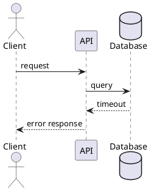
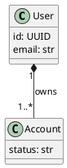
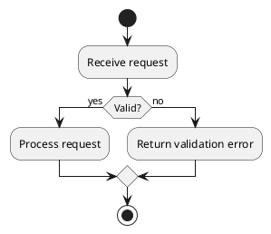
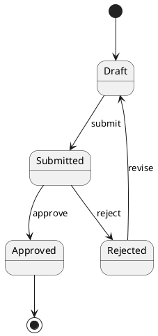
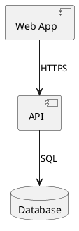

# Examples

## Sequence

```plantuml
@startuml
actor Client
participant API
database Database
Client -> API: request
API -> Database: query
Database --> API: timeout
API --> Client: error response
@enduml
```

## Class

```plantuml
@startuml
class User {
  id: UUID
  email: str
}
class Account {
  status: str
}
User "1" *-- "1..*" Account : owns
@enduml
```

## Activity

```plantuml
@startuml
start
:Receive request;
if (Valid?) then (yes)
  :Process request;
else (no)
  :Return validation error;
endif
stop
@enduml
```

## State

```plantuml
@startuml
[*] --> Draft
Draft --> Submitted : submit
Submitted --> Approved : approve
Submitted --> Rejected : reject
Approved --> [*]
Rejected --> Draft : revise
@enduml
```

## Component

```plantuml
@startuml
component "Web App" as Web
component "API" as API
database "Database" as DB
Web --> API : HTTPS
API --> DB : SQL
@enduml
```
