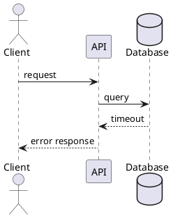
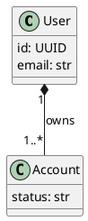
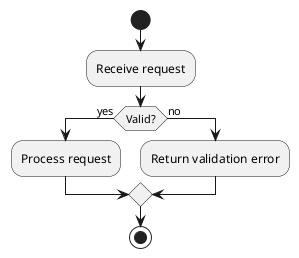
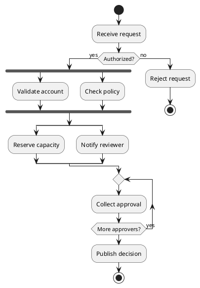
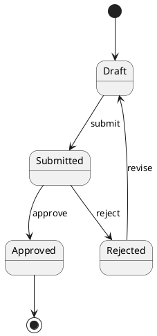
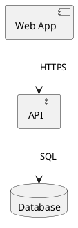
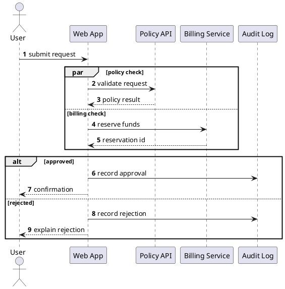

# Examples

## Sequence



## Class



## Activity



## Large Activity



## State



## Component



## Large Sequence



## C4 Container

```plantuml
@startuml
!include C4_Container.puml
Person(user, "User")
System_Boundary(system, "Diagram Service") {
  Container(api, "API", "Python/FastAPI")
}
Rel(user, api, "Uses")
@enduml
```
