# Output Contract

For a normal user-facing diagram request:

```plantuml
@startuml
...
@enduml
```

For an evaluator or script that requests raw PlantUML, output only the PlantUML source, with no Markdown fence.

The document must:

- contain one `@start...` directive and one matching `@end...` directive;
- preserve all required actors/entities and named relationships from the prompt;
- avoid `TODO`, `placeholder`, and fake implementation notes;
- avoid remote includes unless an explicit policy allows them.
