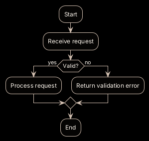
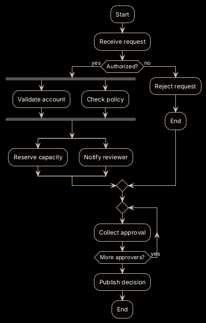
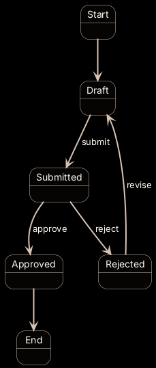
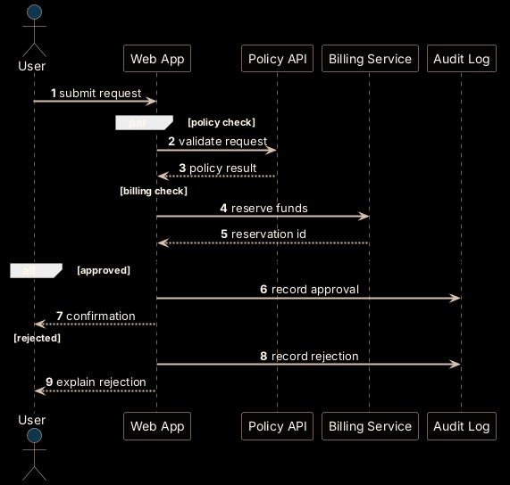

# Examples

## Sequence

```plantuml
@startuml
skinparam backgroundColor #000000
skinparam shadowing false
skinparam defaultFontName Inter
skinparam defaultFontColor #fff8ef
skinparam ArrowColor #d6c3b4
skinparam ArrowFontColor #fff8ef
skinparam ArrowHeadColor #d6c3b4
skinparam ArrowThickness 2
skinparam DefaultTextAlignment center
skinparam ParticipantBackgroundColor #050403
skinparam ParticipantBorderColor #d6c3b4
skinparam ParticipantFontColor #fff8ef
skinparam ActorBackgroundColor #0f364d
skinparam ActorBorderColor #d6c3b4
skinparam ActorFontColor #fff8ef
skinparam DatabaseBackgroundColor #080401
skinparam DatabaseBorderColor #f4d6a1
skinparam DatabaseFontColor #fff8ef
skinparam SequenceLifeLineBorderColor #d6c3b4
skinparam SequenceLifeLineBorderThickness 1
skinparam SequenceArrowThickness 2
actor Client
participant API
database Database
Client -> API: request
API -> Database: query
Database --> API: timeout
API --> Client: error response
@enduml
```

## Class

```plantuml
@startuml
skinparam backgroundColor #000000
skinparam shadowing false
skinparam defaultFontName Inter
skinparam defaultFontColor #fff8ef
skinparam ArrowColor #d6c3b4
skinparam ArrowFontColor #fff8ef
skinparam ArrowHeadColor #d6c3b4
skinparam ArrowThickness 2
skinparam DefaultTextAlignment center
skinparam ClassBackgroundColor #050403
skinparam ClassBorderColor #d6c3b4
skinparam ClassFontColor #fff8ef
hide circle
skinparam ClassAttributeFontColor #fff8ef
skinparam ClassStereotypeFontColor #fff8ef
class User {
  id: UUID
  email: str
}
class Account {
  status: str
}
User "1" *-- "1..*" Account : owns
@enduml
```

## Activity

```plantuml
@startuml
skinparam backgroundColor #000000
skinparam shadowing false
skinparam defaultFontName Inter
skinparam defaultFontColor #fff8ef
skinparam ArrowColor #d6c3b4
skinparam ArrowFontColor #fff8ef
skinparam ArrowHeadColor #d6c3b4
skinparam ArrowThickness 2
skinparam DefaultTextAlignment center
skinparam ActivityBackgroundColor #050403
skinparam ActivityBorderColor #d6c3b4
skinparam ActivityFontColor #fff8ef
skinparam ActivityDiamondFontColor #fff8ef
skinparam ActivityBorderThickness 1
skinparam NoteBackgroundColor #080401
skinparam NoteBorderColor #f4d6a1
skinparam NoteFontColor #fff8ef
:Start;
:Receive request;
if (Valid?) then (yes)
  :Process request;
else (no)
  :Return validation error;
endif
:End;
@enduml
```

## Large Activity

```plantuml
@startuml
skinparam backgroundColor #000000
skinparam shadowing false
skinparam defaultFontName Inter
skinparam defaultFontColor #fff8ef
skinparam ArrowColor #d6c3b4
skinparam ArrowFontColor #fff8ef
skinparam ArrowHeadColor #d6c3b4
skinparam ArrowThickness 2
skinparam DefaultTextAlignment center
skinparam ActivityBackgroundColor #050403
skinparam ActivityBorderColor #d6c3b4
skinparam ActivityFontColor #fff8ef
skinparam ActivityDiamondFontColor #fff8ef
skinparam ActivityBorderThickness 1
:Start;
:Receive request;
if (Authorized?) then (yes)
  fork
    :Validate account;
  fork again
    :Check policy;
  end fork
  split
    :Reserve capacity;
  split again
    :Notify reviewer;
  end split
else (no)
  :Reject request;
  :End;
endif
repeat
  :Collect approval;
repeat while (More approvers?) is (yes)
:Publish decision;
:End;
@enduml
```

## State

```plantuml
@startuml
skinparam backgroundColor #000000
skinparam shadowing false
skinparam defaultFontName Inter
skinparam defaultFontColor #fff8ef
skinparam ArrowColor #d6c3b4
skinparam ArrowFontColor #fff8ef
skinparam ArrowHeadColor #d6c3b4
skinparam ArrowThickness 2
skinparam DefaultTextAlignment center
skinparam StateBackgroundColor #050403
skinparam StateBorderColor #d6c3b4
skinparam StateFontColor #fff8ef
skinparam StateAttributeFontColor #fff8ef
state "Start" as Start
state Draft
state Submitted
state Approved
state Rejected
state "End" as End
Start --> Draft
Draft --> Submitted : submit
Submitted --> Approved : approve
Submitted --> Rejected : reject
Approved --> End
Rejected --> Draft : revise
@enduml
```

## Component

```plantuml
@startuml
skinparam backgroundColor #000000
skinparam shadowing false
skinparam defaultFontName Inter
skinparam defaultFontColor #fff8ef
skinparam ArrowColor #d6c3b4
skinparam ArrowFontColor #fff8ef
skinparam ArrowHeadColor #d6c3b4
skinparam ArrowThickness 2
skinparam DefaultTextAlignment center
skinparam ComponentBackgroundColor #050403
skinparam ComponentBorderColor #d6c3b4
skinparam ComponentFontColor #fff8ef
skinparam ComponentBorderThickness 1
skinparam DatabaseBackgroundColor #080401
skinparam DatabaseBorderColor #f4d6a1
skinparam DatabaseFontColor #fff8ef
component "Web App" as Web
component "API" as API
database "Database" as DB
Web --> API : HTTPS
API --> DB : SQL
@enduml
```

## Large Sequence

```plantuml
@startuml
skinparam backgroundColor #000000
skinparam shadowing false
skinparam defaultFontName Inter
skinparam defaultFontColor #fff8ef
skinparam ArrowColor #d6c3b4
skinparam ArrowFontColor #fff8ef
skinparam ArrowHeadColor #d6c3b4
skinparam ArrowThickness 2
skinparam DefaultTextAlignment center
skinparam ParticipantBackgroundColor #050403
skinparam ParticipantBorderColor #d6c3b4
skinparam ParticipantFontColor #fff8ef
skinparam ActorBackgroundColor #0f364d
skinparam ActorBorderColor #d6c3b4
skinparam ActorFontColor #fff8ef
skinparam SequenceLifeLineBorderColor #d6c3b4
skinparam SequenceLifeLineBorderThickness 1
skinparam SequenceArrowThickness 2
actor User
participant "Web App" as Web
participant "Policy API" as Policy
participant "Billing Service" as Billing
participant "Audit Log" as Audit
autonumber
User -> Web: submit request
par policy check
  Web -> Policy: validate request
  Policy --> Web: policy result
else billing check
  Web -> Billing: reserve funds
  Billing --> Web: reservation id
end
alt approved
  Web -> Audit: record approval
  Web --> User: confirmation
else rejected
  Web -> Audit: record rejection
  Web --> User: explain rejection
end
@enduml
```

## C4 Container

```plantuml
@startuml
!include <C4/C4_Container.puml>
skinparam backgroundColor #000000
skinparam shadowing false
skinparam defaultFontName Inter
skinparam defaultFontColor #fff8ef
skinparam ArrowColor #d6c3b4
skinparam ArrowFontColor #fff8ef
UpdateElementStyle("person", $bgColor="#0f364d", $fontColor="#fff8ef", $borderColor="#d6c3b4")
UpdateElementStyle("external_person", $bgColor="#080401", $fontColor="#fff8ef", $borderColor="#f4d6a1")
UpdateElementStyle("system", $bgColor="#050403", $fontColor="#fff8ef", $borderColor="#d6c3b4")
UpdateElementStyle("external_system", $bgColor="#080401", $fontColor="#fff8ef", $borderColor="#f4d6a1")
UpdateElementStyle("container", $bgColor="#050403", $fontColor="#fff8ef", $borderColor="#d6c3b4")
UpdateElementStyle("external_container", $bgColor="#080401", $fontColor="#fff8ef", $borderColor="#f4d6a1")
UpdateElementStyle("boundary", $bgColor="#080401", $fontColor="#fff8ef", $borderColor="#d6c3b4")
UpdateRelStyle($textColor="#fff8ef", $lineColor="#d6c3b4")
UpdateBoundaryStyle("system", $bgColor="#080401", $fontColor="#fff8ef", $borderColor="#d6c3b4")
UpdateBoundaryStyle("container", $bgColor="#080401", $fontColor="#fff8ef", $borderColor="#d6c3b4")
UpdateBoundaryStyle("", $bgColor="#080401", $fontColor="#fff8ef", $borderColor="#d6c3b4")
AddRelTag("risk", $textColor="#fff8ef", $lineColor="#f87800", $lineStyle=DashedLine())
Person(user, "User")
System_Boundary(system, "Diagram Service") {
  Container(api, "API", "Python/FastAPI")
}
Rel(user, api, "Uses")
@enduml
```
