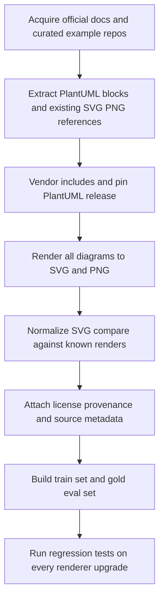
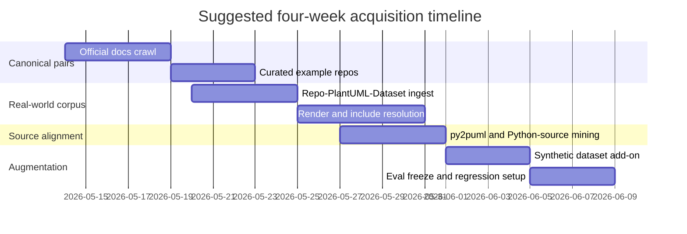
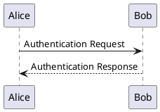
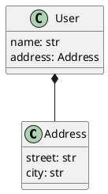
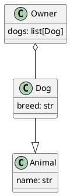

# PlantUML Training Data Report

## Executive summary

The strongest public foundation for training and verifying an AI skill that generates PlantUML is not a single dataset. It is a **stack** of complementary sources: a canonical syntax-and-render layer from the official documentation at PlantUML official docs, a real-world corpus layer from Repo-PlantUML-Dataset on Zenodo and its mirror repo-plantuml-dataset on Hugging Face, an architecture-specialized layer from C4-PlantUML, a Python-source-to-PlantUML bridge from py2puml, and a scale booster from Synthetic UML Diagram Dataset (PlantUML). Based on the materials reviewed, **no single public source currently provides the full trifecta of broad coverage, rendered outputs, and original Python source code at scale**; you will get the best results by combining these sources into a reproducible acquisition-and-verification pipeline.

For a practical build, I would prioritize this order: **official PlantUML docs → Repo-PlantUML-Dataset → C4-PlantUML → py2puml → Synthetic UML Diagram Dataset**, then add specialized icon-heavy repos such as plantuml-stdlib and AWS Icons for PlantUML if you want cloud-architecture competence. The official docs give you high-quality code↔render pairs; Repo-PlantUML-Dataset adds realistic naming, structure, and project context; C4-PlantUML adds modern architecture idioms; py2puml gives the cleanest Python↔PlantUML alignment I found; and the synthetic dataset gives volume, but only for activity and sequence diagrams and with synthetic language patterns.

A second major conclusion is that **verification reproducibility matters as much as corpus size**. PlantUML has active releases, the official repo shows a current release cadence, and the PlantUML organization publishes pdiff specifically to compare output differences across versions. That means you should pin the PlantUML release, cache or vendor `!include` dependencies, prefer normalized SVG comparison over raw byte comparison, and keep a gold evaluation set made of official docs and curated example repos.

## Candidate datasets and repositories

The table below consolidates the highest-confidence candidates I found. Where the landing page did **not** publish a numeric example count or a clear SPDX-style license in the retrieved snippet, I mark that explicitly instead of inferring it.

| Candidate | License | Published size | Languages present | Python source included | Diagram types | Rendered outputs present | Verification reproducibility notes | Evidence |
|---|---|---:|---|---|---|---|---|---|
| PlantUML official docs | Not clearly stated on reviewed docs pages | Not published; crawl-derived | PlantUML + docs text | No | Sequence, use case, class, activity, component, state, object, deployment, timing, plus non-UML pages in site nav | Yes, inline images paired with source blocks | Very strong for code↔render pairing, but you must snapshot pages and pin renderer version |  |
| Repo-PlantUML-Dataset on Zenodo | Original repo licenses retained; dataset page says users must comply per file | 1,026 PlantUML files from 68 public repos across 13 languages | 13 repository languages | Not bundled as source pairs; repo metadata only | Real-world mixed PlantUML corpus | No pre-rendered images in dataset description | Good provenance; must re-render and separately resolve includes/licenses |  |
| Synthetic UML Diagram Dataset (PlantUML) | Not visible in retrieved snippet; verify on record | Extra Large subset: 120k train + 30k test **per category**; categories are activity and sequence | PlantUML | No | Activity, sequence | Yes; each diagram is accompanied by PlantUML code | Excellent for render-pair volume; weaker realism/diversity |  |
| C4-PlantUML | MIT | Not published; repo exposes `samples` and `images` dirs | PlantUML | No | Context, container, component, dynamic, deployment, C4-styled sequence | Yes, linked images in README and sample pages | High if repo tag is pinned and includes are vendored |  |
| plantuml-stdlib | Not clearly surfaced in retrieved snippet; verify on clone | Not published; repo exposes `output`, `script`, `stdlib` dirs | Primarily Java repo for official stdlib assets | No | AWS, Azure, Bootstrap, DomainStory, ELK, GCP, K8S, Material, and other stdlib-backed diagrams | Yes, README shows repeated code↔image examples | Strong specialized corpus; requires local vendoring of stdlib and includes |  |
| AWS Icons for PlantUML | Repo includes `LICENSE` and `LICENSE-CODE`; verify asset terms | Not published; repo exposes `dist`, `examples`, `scripts`, `source` dirs | Python tooling + PlantUML assets | Python build/tooling scripts, not Python application↔diagram pairs | AWS architecture diagrams, raw icon usage, simplified views, sequence diagrams | Yes, examples are part of README/docs | Good for AWS-focused evaluation; licensing and icon provenance need care |  |
| py2puml | MIT | Not published; repo exposes `src` and `tests` and 181 commits | Python | Yes | Class diagrams for Python applications/data structures | Not surfaced as pre-rendered images on retrieved page | Excellent for automated source→PlantUML regression tests |  |
| PlantUML-Examples by mattjhayes | Apache-2.0 | Not published; compact example repo with `docs` folder | PlantUML/docs | No | Multiple PlantUML diagram types | Yes; repo says it has examples of code and diagrams | Good small permissive seed set; lower diversity than corpora above |  |
| coni2k/PlantUML reference repo | MIT | Not published; reference mirror of guide examples | PlantUML/docs | No | Guide examples across language reference | Intended to be renderable locally; sanity checks documented | Useful frozen benchmark snapshot, but older PlantUML/guide versions |  |

Two additional sources are important operationally even though I would not treat them as primary training corpora: the official source repo at plantuml/plantuml, which exposes the broader codebase and release stream, and plantuml/plantuml-test plus pdiff, which are more about testing and rendering drift than about supplying training examples. They are still very useful for a verification harness.

## Suitability assessment by candidate

### PlantUML official docs

This is the best **high-precision seed corpus** I found for PlantUML syntax generation. The reviewed sequence-diagram page contains repeated source blocks (`@startuml ... @enduml`) directly adjacent to rendered images, and the site navigation spans the major UML and non-UML families that PlantUML supports. That makes the docs uniquely useful for training a model to emit **canonical, idiomatic syntax** and for verifying outputs against an authoritative rendered reference.

Its weakness is packaging and licensing, not quality. The docs are a **documentation site**, not a formally versioned ML dataset, and the reviewed pages did not clearly state a redistribution license. My recommendation is to use this source first for **evaluation, few-shot exemplars, syntax tests, and carefully curated training subsets**, not for blind bulk mirroring, until you verify reuse terms. For reproducibility, snapshot pages and pin the PlantUML release used to re-render them.

### Repo-PlantUML-Dataset on Zenodo

This is the best **real-world text corpus** in the reviewed set. It aggregates 1,026 PlantUML files from 68 public repositories across 13 languages and keeps repository-level metadata and source attribution. That combination makes it highly valuable for learning realistic naming conventions, modularity patterns, mixed diagram styles, and repository heterogeneity that official examples usually do not capture.

Its main limitation is that it is **not multimodal by itself**. The dataset description says it contains PlantUML source files plus metadata, and explicitly says no normalization or validation was applied. So it is excellent as the backbone for a train corpus, but only after you re-render it, run syntax checks, resolve broken includes, and filter by license. I would treat it as the main source for “how people really write PlantUML,” not as an out-of-the-box gold verification set.

### Synthetic UML Diagram Dataset (PlantUML)

This is the strongest source for **pure scale in code↔image pairing**. The dataset page states that each diagram is accompanied by PlantUML code and that it focuses on activity and sequence diagrams, with the Extra Large subsets reaching 120,000 train and 30,000 test diagrams per category. For image-based verification, OCR-less diagram parsing research, or robustness tests across many render pairs, that is extremely useful.

The downside is realism. The record describes the data as generated from randomized text strings based on PlantUML syntax, so while it scales well, it does not reflect repository-level naming, architectural conventions, or source-code-driven structure. I would use it **only as augmentation**: for render stability, diagram-type recognition, and robustness training. I would not let it dominate the corpus if the goal is a practical AI skill that produces convincing, human-like PlantUML.

### C4-PlantUML

This is the most important architecture-specialized candidate. The repo is MIT-licensed, exposes `samples` and `images` directories, and covers the C4 family: context, container, component, dynamic, deployment, and C4-styled sequence diagrams. The README also links advanced samples derived from Simon Brown’s C4 examples, which makes it particularly valuable if your AI skill must generate architecture documentation rather than only classical UML.

Its scope is narrower than a general PlantUML corpus, but the quality is high. The main operational caution is that many examples rely on includes/macros, so reproducibility depends on pinning a release tag and vendoring dependencies rather than trusting remote master-branch includes. For eval, C4-PlantUML is excellent. For training, I would weight it heavily only if architecture diagrams are an important target domain.

### plantuml-stdlib

This is an official standard-library source that is highly valuable for **icon-rich and ecosystem-specific diagrams**. The retrieved repo structure includes `output`, `script`, and `stdlib`, and the README shows repeated examples that render to images for AWS, Azure, Bootstrap, Domain Story, ELK, GCP, K8S, and Material icons. If you want your model to generate realistic cloud or platform diagrams with standard library includes, this repo is a major asset.

It is less suitable as a first-line general dataset because the examples are often **macro-heavy** and therefore less self-contained than simpler PlantUML examples. That is fine for advanced skill training, but it can obscure the base syntax if overused early. I would use plantuml-stdlib after establishing a clean baseline from official docs and real-world `.puml` corpora, and only after you lock a specific stdlib snapshot. The license also was not clearly visible in the retrieved snippet, so verify it directly on clone before redistribution.

### AWS Icons for PlantUML

This repo is particularly strong for **AWS architecture diagrams**. The retrieved page shows `dist`, `examples`, `scripts`, and `source`, and the README explicitly highlights examples such as basic usage, raw images, simplified view, and sequence diagrams. It also includes Python tooling files, which is useful for acquisition/build automation even though the repo is not a Python-source-to-PlantUML dataset in the same sense as py2puml.

Its value is specialized rather than universal. It should be part of your corpus if the AI skill must generate cloud diagrams with service icons and branded components. It should not be a dominant pretraining source because the icon layer can dominate the syntax distribution. Also, because the repo contains both `LICENSE` and `LICENSE-CODE`, you should assume the code and the rendered/icon assets may have different constraints until you verify terms.

### py2puml

This is the cleanest source I found for **Python source code ↔ PlantUML alignment**. The repo is MIT-licensed, is clearly a Python project with `src` and `tests`, and the README says the output can be versioned alongside code and checked by automated tests using `assert_py2puml_command_args`. That makes py2puml unusually attractive for training or verifying an AI skill that must generate PlantUML from Python modules, especially class diagrams.

Its weakness is breadth: it is a tool repo, not a massive corpus, and the retrieved pages did not surface pre-rendered images. Still, for building a **source-code-conditioned gold set**, py2puml is one of the highest-value assets reviewed here. The combination of Python fixtures, expected `.puml`, and assertion-based regression testing is exactly what you want in a verification suite.

### PlantUML-Examples by mattjhayes

This is a small but useful permissively licensed example repo. The retrieved page describes it as a repo of PlantUML code and diagrams, with an Apache-2.0 license and a `docs` directory. That makes it attractive as a **lightweight seed or sanity-check corpus**, especially if you want easy redistribution and a narrow, hand-curated example style.

Its limitations are scale and representativeness. Compared with the official docs or the real-world Repo-PlantUML-Dataset, it is much smaller and less diverse. I would use it for smoke tests, demos, and a few curated eval cases, not as a central training set.

### coni2k/PlantUML reference repo

This repo is valuable because it explicitly positions itself as a **reference repository for the examples in the PlantUML Language Reference Guide** and is MIT-licensed. It also documents the exact versions it used: PlantUML 1.2020.18, GraphViz 2.38.0, and Language Reference Guide 1.2019.9. For reproducible benchmarking, that explicit version pinning is a real advantage.

The tradeoff is age. Because the snapshot is tied to older versions, it is useful as a stable benchmark or compatibility set, but not as a current reference for the latest syntax and rendering behavior. I would keep it as a **frozen eval corpus**, not as the main corpus for modern training.

## Recommended top five and acquisition plan

### Recommended top five

My recommended top five, in priority order, are:

1. **PlantUML official docs** for canonical syntax and direct code↔render pairing.
2. **Repo-PlantUML-Dataset on Zenodo** for real-world diversity and provenance.
3. **C4-PlantUML** for architecture diagrams and high-quality sample renders.
4. **py2puml** for Python source↔PlantUML verification data.
5. **Synthetic UML Diagram Dataset (PlantUML)** for volume, but only as augmentation.

If you have budget for two specialized extensions, add **plantuml-stdlib** and **AWS Icons for PlantUML** to improve icon-rich and cloud-architecture performance. If you want a frozen benchmark snapshot, add **coni2k/PlantUML reference repo**.

### Prioritized acquisition workflow

The right workflow is: acquire authoritative pairs first, then broaden, then specialize, then augment. The rationale is that official docs and curated example repos give cleaner supervision than real-world corpora; real-world corpora give diversity; source-driven repos give alignment to Python; and synthetic corpora give scale but can distort style if used too early. Active PlantUML releases and renderer-drift tooling such as pdiff make version pinning essential.





### Practical scripts, tools, and preprocessing steps

Use a manifest-first acquisition pipeline. The core tools are `git`, a small HTML crawler for official docs, a PlantUML renderer pinned to a single release, `ripgrep` for extracting `@start.../@end...` blocks, and SVG/PNG comparison utilities. For comparisons, prefer **normalized SVG** first, and use raster comparison only as a fallback when the source only publishes PNG. That recommendation follows directly from the fact that official docs and example repos often expose source blocks and rendered images, while PlantUML’s release stream and diff tooling show that render details can shift across versions.

A good preprocessing order is:

1. **Pin the renderer** to one PlantUML release and record version metadata in every manifest row. Use the release you standardize on for all rendering and re-rendering.
2. **Extract PlantUML blocks** from docs pages, README pages, `.puml` files, and markdown fences.
3. **Classify diagram type** from `@start...` directives or syntax heuristics.
4. **Resolve includes** by vendoring the exact stdlib/C4/AWS include snapshot used for the run.
5. **Render to SVG and PNG**.
6. **Compare to published assets**. Normalize SVG DOMs first; if only PNG is available, compare with perceptual hash or SSIM.
7. **Attach provenance**: original URL, repo/tag/commit if known, license, diagram type, include dependencies, render status, and verification result.
8. **Split data by purpose**: training, gold verification, renderer regression, Python-source alignment, architecture specialization.

A minimal manifest schema should look like this:

```json
{
  "id": "c4_message_bus_001",
  "source_name": "C4-PlantUML",
  "source_url": "repo-or-page-url",
  "license": "MIT",
  "diagram_type": "c4_container",
  "puml_path": "samples/message-bus.puml",
  "published_render_path": "images/message-bus.svg",
  "python_source_paths": [],
  "include_deps": ["C4_Container.puml"],
  "plantuml_version": "v1.2026.2",
  "render_status": "ok",
  "verification_status": "svg_match"
}
```

### Sample Python verification script

The script below is deliberately conservative: it renders PlantUML to SVG using a pinned local jar, canonicalizes the SVG to remove unstable differences, and compares normalized structural hashes. This is the right default for a verification harness because raw SVG bytes can differ even when the visual output is effectively unchanged. That advice is motivated by the active release stream and by PlantUML’s own diff tooling.

```python
from __future__ import annotations

import hashlib
import re
import subprocess
import xml.etree.ElementTree as ET
from pathlib import Path
from typing import Iterable

PLANTUML_JAR = Path("tools/plantuml-1.2026.2.jar")


def render_svg(puml_text: str, jar_path: Path = PLANTUML_JAR) -> str:
    """
    Render PlantUML text to SVG using a pinned local PlantUML jar.
    Raises RuntimeError if rendering fails.
    """
    proc = subprocess.run(
        ["java", "-jar", str(jar_path), "-tsvg", "-pipe", "-charset", "UTF-8"],
        input=puml_text.encode("utf-8"),
        stdout=subprocess.PIPE,
        stderr=subprocess.PIPE,
        check=False,
    )
    if proc.returncode != 0:
        raise RuntimeError(proc.stderr.decode("utf-8", errors="replace"))
    return proc.stdout.decode("utf-8", errors="replace")


def _strip_unstable_text(svg: str) -> str:
    # Remove comments and obvious generator metadata that can change between runs
    svg = re.sub(r"<!--.*?-->", "", svg, flags=re.S)
    svg = re.sub(r"\s+xmlns:xlink=\"[^\"]*\"", "", svg)
    # Normalize ids, clipPaths, and URLs that often get regenerated
    svg = re.sub(r'id="[^"]+"', 'id=""', svg)
    svg = re.sub(r'url\(#.*?\)', 'url(#)', svg)
    return svg


def normalize_svg(svg: str) -> bytes:
    """
    Canonical-ish normalization sufficient for structural regression checks.
    """
    svg = _strip_unstable_text(svg)
    root = ET.fromstring(svg)

    def sort_element(elem: ET.Element) -> None:
        elem.attrib = dict(sorted(elem.attrib.items()))
        for child in list(elem):
            sort_element(child)
        elem[:] = sorted(
            list(elem),
            key=lambda e: (e.tag, tuple(sorted(e.attrib.items())), (e.text or "").strip()),
        )

    sort_element(root)
    return ET.tostring(root, encoding="utf-8")


def svg_hash(svg: str) -> str:
    return hashlib.sha256(normalize_svg(svg)).hexdigest()


def verify_against_reference(puml_text: str, reference_svg: str) -> bool:
    rendered = render_svg(puml_text)
    return svg_hash(rendered) == svg_hash(reference_svg)
```

If your references are PNG-only, add a second-stage comparator rather than replacing the SVG comparator. A typical fallback is: render both to PNG at the same DPI, crop whitespace, then compare perceptual hash and SSIM thresholds. Use the fallback only when SVG-level verification is impossible.

### Source-code-conditioned verification pseudocode

This pattern is especially relevant for Python-driven corpora such as py2puml, where the repo itself describes versioned expected `.puml` outputs and test assertions.

```python
for case in python_source_cases:
    python_files = load_python_sources(case.python_paths)
    expected_puml = read_text(case.expected_puml_path)

    generated_puml = model.generate_from_python(python_files)
    syntax_ok = plantuml_parse(generated_puml)

    if not syntax_ok:
        record(case, status="syntax_error")
        continue

    same_text = normalize_puml(generated_puml) == normalize_puml(expected_puml)

    expected_svg = render_svg(expected_puml)
    generated_svg = render_svg(generated_puml)
    same_render = svg_hash(expected_svg) == svg_hash(generated_svg)

    record(
        case,
        status="ok",
        text_match=same_text,
        render_match=same_render,
    )
```

A straightforward `normalize_puml` function can remove comments, standardize whitespace, normalize line endings, and optionally sort some declaration blocks where order is semantically irrelevant.

## Gaps, augmentation methods, and example pairs

### Gaps in the current public landscape

The biggest gap is a **broad public dataset that jointly provides**:
- natural-language task description,
- PlantUML source,
- rendered SVG/PNG, and
- original source code, preferably Python,
for the same example. The sources reviewed break along modality boundaries: official docs provide code+render pairs; Repo-PlantUML-Dataset provides real-world `.puml` plus provenance but not images; py2puml provides Python↔PlantUML alignment; the synthetic dataset provides code+images but only for two diagram types and without source code.

A second gap is **licensing clarity**. Repo-PlantUML-Dataset explicitly preserves original repository licenses, which is good for provenance but inconvenient for redistribution. Some other reviewed sources did not surface a clear license in the retrieved snippet. That means the safest production workflow is to keep rich per-file provenance metadata and build training subsets only after license filtering.

A third gap is **version-stable verification**. Official releases continue, and PlantUML publishes tools specifically for cross-version diffing. If you evaluate generated diagrams only by text equality, you will miss semantically equivalent cases; if you evaluate only by pixels without pinning versions and includes, you will get avoidable false negatives.

### Recommended augmentation methods

The most effective augmentation strategy is to build a **three-layer corpus**:

- **Layer A: canonical gold pairs** from official docs and curated repos such as C4-PlantUML and small example repos.
- **Layer B: real-world mined pairs** from Repo-PlantUML-Dataset, with your own rendering and provenance attachment.
- **Layer C: synthetic volume** from the Synthetic UML dataset, used only after down-weighting or style-balancing.

For crawling, prioritize repositories surfaced by the existing corpus and by the PlantUML topic index on GitHub topics for plantuml. In the retrieved snapshot, that topic had hundreds of public repositories, which is enough to scale further once you apply filters such as permissive license, presence of `.puml` plus `.svg/.png`, existence of `examples/` or `samples/`, and recent maintenance. Start from the 68-repo seed in Repo-PlantUML-Dataset, then expand with topic-filtered repos.

Useful pairing heuristics are:

- same-basename pairing, such as `foo.puml` ↔ `foo.svg` or `foo.png`;
- README adjacency, where a `@startuml` block is immediately followed by an image;
- section-title pairing on docs pages;
- source-code-conditioned pairing, where a repo explicitly versions expected PlantUML from source, as in py2puml-style tests;
- include dependency capture, so every example records whether it is self-contained or stdlib/C4/AWS-dependent.

For annotation, add lightweight derived labels that make the corpus more useful than raw files alone:

- `diagram_type`
- `is_self_contained`
- `uses_include`
- `uses_icon_library`
- `render_verified`
- `source_conditioned`
- `python_source_paths`
- `license_family`
- `render_fail_reason`

These labels are cheap to compute and dramatically improve both training curriculum design and evaluation slicing.

### Representative example pairs

The examples below are **original, minimal illustrations** designed to match the kinds of pairs present in the reviewed sources: canonical docs-style UML, C4-style architecture, and Python→PlantUML class-diagram generation. That pattern is directly supported by the official docs, C4-PlantUML, and py2puml-style repositories.

#### Example A

A minimal official-docs-style sequence example is typically a small self-contained `.puml` block whose render shows two participants and a request/response arrow pair.



**Expected render:** two lifelines, a solid request arrow from Alice to Bob, and a dotted response arrow back.

#### Example B

A minimal C4-style architecture example uses includes/macros and renders as a context or container view rather than a classical UML class diagram.

```plantuml
@startuml
!include C4_Container.puml
Person(user, "User")
System_Boundary(app, "App") {
  Container(api, "API", "Python/FastAPI")
}
Rel(user, api, "Uses")
@enduml
```

**Expected render:** a person node connected to a container inside a labeled system boundary.

#### Example C

A representative Python-source-conditioned pair, in the spirit of Python→PlantUML generators, looks like this.

```python
from dataclasses import dataclass

@dataclass
class Address:
    street: str
    city: str

@dataclass
class User:
    name: str
    address: Address
```

Possible corresponding PlantUML:



**Expected render:** two classes, `User` and `Address`, with a composition relationship from `User` to `Address`.

#### Example D

A second Python example emphasizes inheritance and collection-like associations.

```python
class Animal:
    name: str

class Dog(Animal):
    breed: str

class Owner:
    dogs: list[Dog]
```

Possible corresponding PlantUML:



**Expected render:** `Dog` inherits from `Animal`, while `Owner` aggregates one or more `Dog` instances.

These example forms are ideal for evaluation because they isolate syntax, semantic structure, and render behavior without dragging in licensing ambiguity from large copied samples.

## Legal and licensing risks

The most important licensing risk is **mixing per-file licenses into a redistributable aggregate without preserving provenance**. Repo-PlantUML-Dataset explicitly says each file retains its original repository license and that users are responsible for compliance. That is a strong signal that you should store license metadata per example, not just per dataset. If you redistribute a merged corpus, do it only after license-family filtering and attribution normalization.

A second risk is **documentation and asset reuse**. The official docs are extremely valuable, but the reviewed pages did not clearly state a redistribution license. Likewise, icon-heavy repos can have different terms for code, generated assets, and upstream iconography. The AWS icons repo surfaces both `LICENSE` and `LICENSE-CODE`, and plantuml-stdlib is an official repo but the retrieved snippet did not make its effective redistribution terms obvious. Use these sources freely for benchmarking and internal training experiments only after verifying exact terms on clone; for public redistribution, be stricter.

A third risk is **version-based reproducibility and hidden network dependency**. If a sample uses `!include` from a remote URL or depends on a moving master branch, the training example itself can drift over time. That is not only a technical reproducibility problem; it also creates compliance and archival issues. Vendor dependencies locally, record checksums, and set your renderer security profile conservatively when batch-rendering externally sourced files. The PlantUML server docs also emphasize security-profile controls for remote access.

Best practices:

- keep a **row-level provenance manifest**;
- filter to **permissive licenses** for broad training sets;
- use docs pages and unclear-license sources mainly for **evaluation and curated internal sets** until terms are confirmed;
- vendor `!include` dependencies;
- pin PlantUML version and retain render hashes;
- separate **gold eval** from **bulk training**;
- never let unlabeled, mixed-license files silently flow into the same bucket.

## Open questions and limitations

Some repository landing pages did not expose a clean numeric example count or an unambiguous license in the retrieved snippet, so I marked those values as “not published” or “verify on clone” instead of guessing. That affects, in particular, the exact example counts for the official docs corpus, plantuml-stdlib, and several smaller example repos.

I also excluded at least one tempting but out-of-scope option: UML-Generator-Dataset-DeepSeek-V3.2. It is a syntax-generation dataset, but it is **XMI-oriented rather than PlantUML-oriented** and includes reasoning traces, so it is not a good fit for the PlantUML-specific skill you described.

The highest-confidence conclusion remains unchanged despite those limitations: if your goal is a production-quality AI skill for generating PlantUML, the best path is a **hybrid dataset assembly** built from official docs, real-world `.puml` corpora, architecture-specific repos, and a small Python-source bridge, all wrapped in a pinned-version render-and-compare verification pipeline.